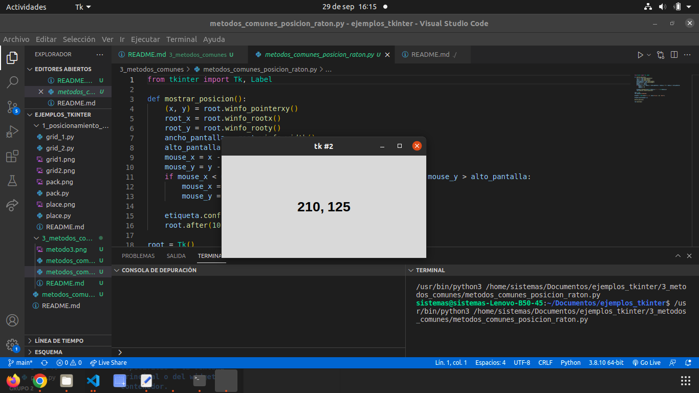

# 2. METODOS_COMUNES

## Metodo Comun Foco

### Este metodo permite poner letras en diferentes label para un uso didactico.

## Metodo Comun Posicion

### Funciona por medio del mouse dependiendo que tanto lo muevas se iran moviendo los numeros de la pantalla, simplemente con base en la posicion del mouse.

## Metodo comun temporizador

### Este metodo permite mostrar un texto en la pantalla en forma de movimiento, que va de mas pequeño a mas grande.

