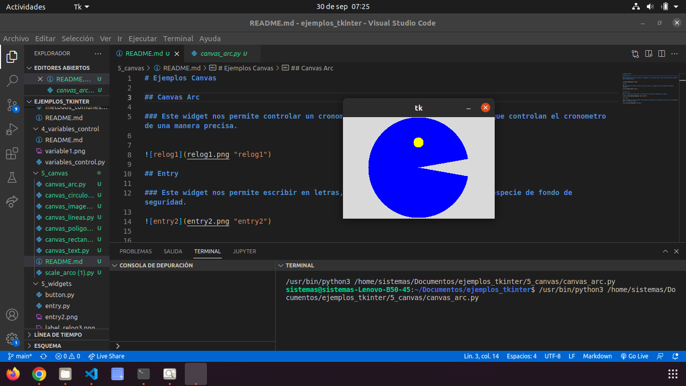
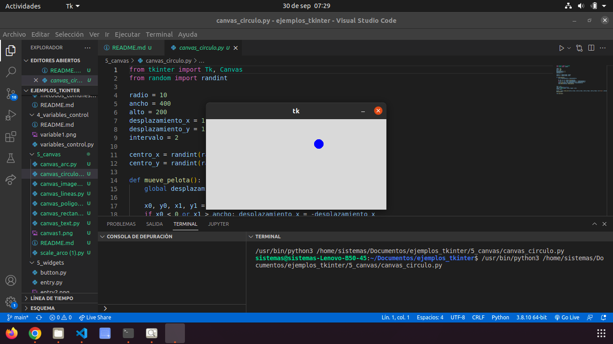
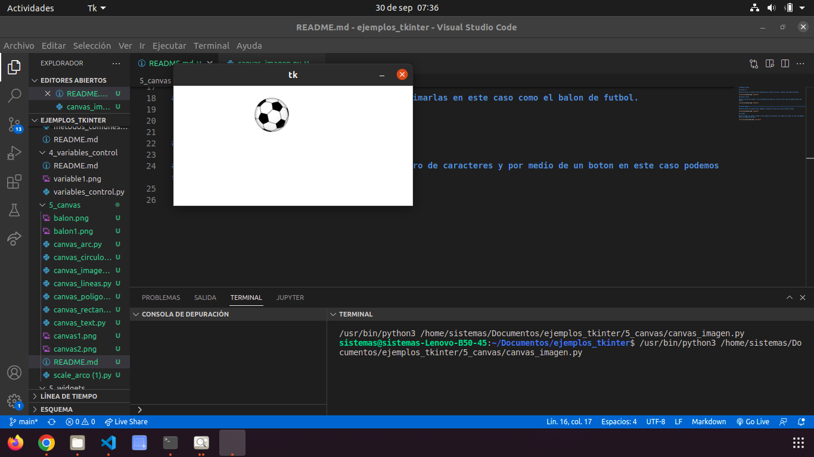
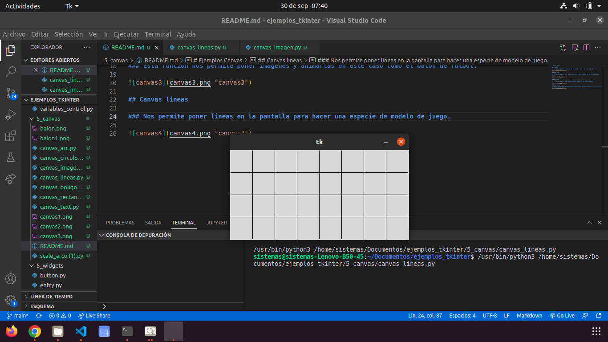
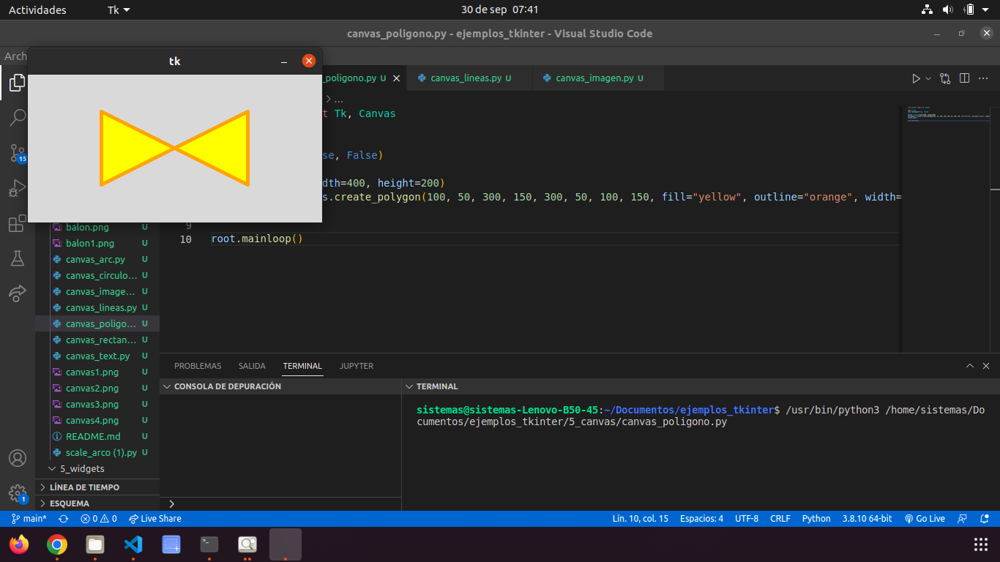
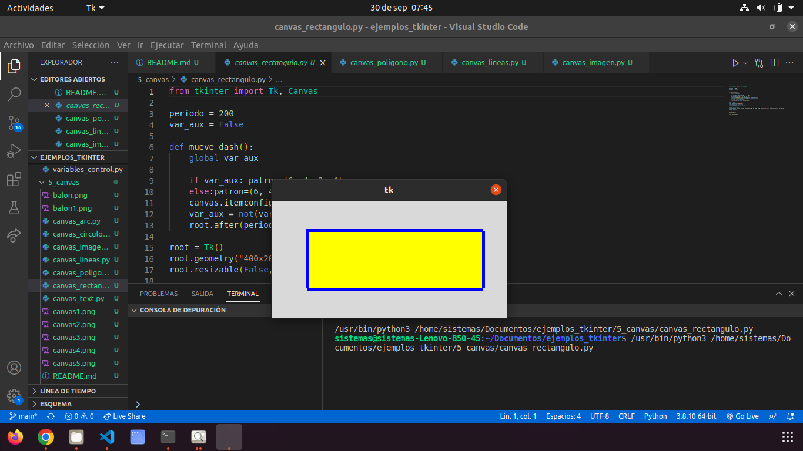
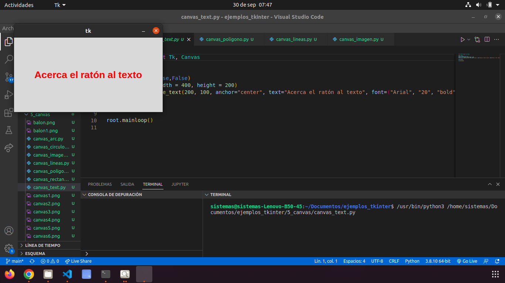
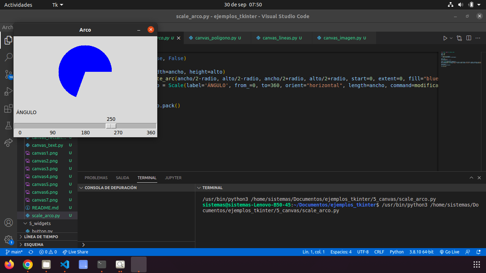

# Ejemplos Canvas

## Canvas Arc

### Esta funcion nos permite crear animaciones por medio de circulos y angulos que tengan movimiento.

## Canvas Circulo

### Esta funcion nos permite  crear animaciones por medio de circulos en este caso una pequeña pelota que rebota.

## Canvas Imagen

### Esta funcion nos permite poner imagenes y animarlas en este caso como el balon de futbol.

## Canvas lineas

### Nos permite poner lineas en la pantalla para hacer una especie de modelo de juego.

# Canvas Poligono

## Nos permite hacer figuras en forma de poligonos y mostrarlas en la pantalla.

# Canvas Rectangulo

## Nos permite hacer rectangulos y objetos parecidos con colores y mostrarlos en la pantalla.

# Canvas Text

## Nos permite cambiar el color de la letra mediante el mouse y automaticamente se cambiar el color si se le acerca el mouse.

# Scale Arco

## Nos permite hacer figuras con los angulos mediante el movimiento del scroll se va haciendo mas grande dependiendo de los angulos

