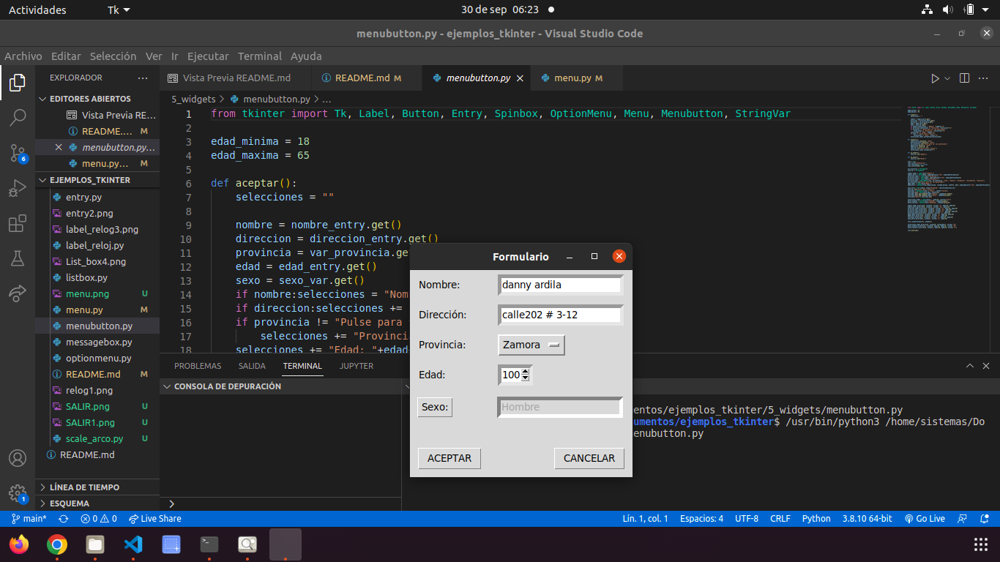
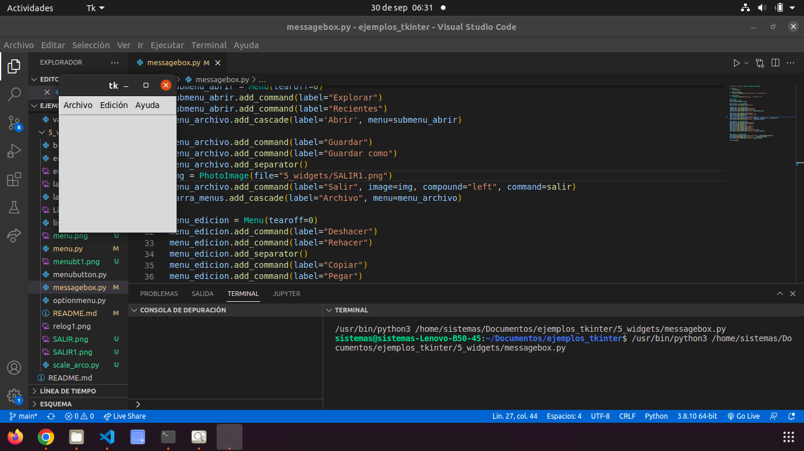
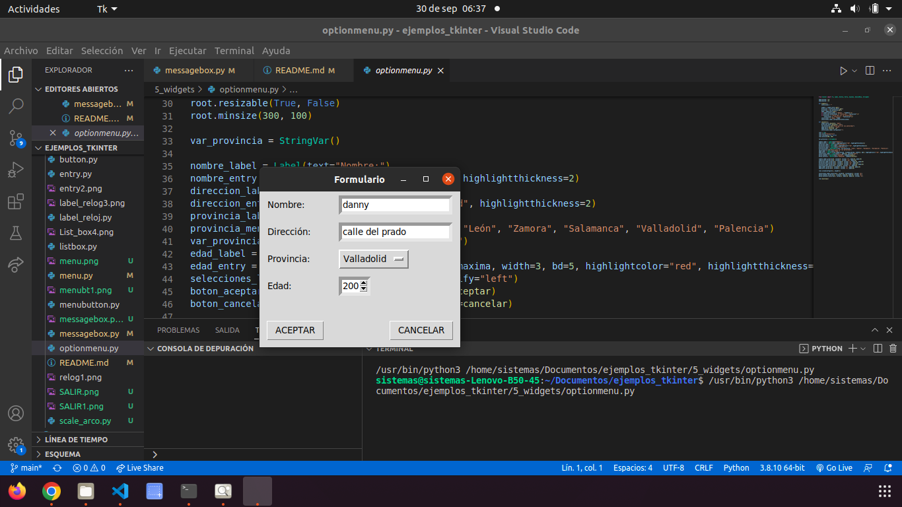
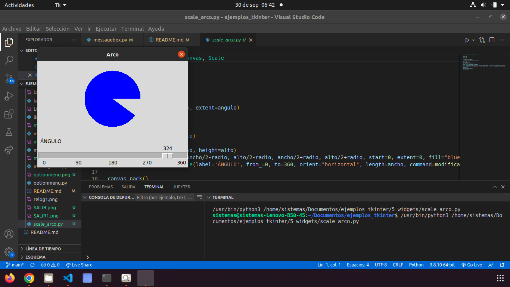
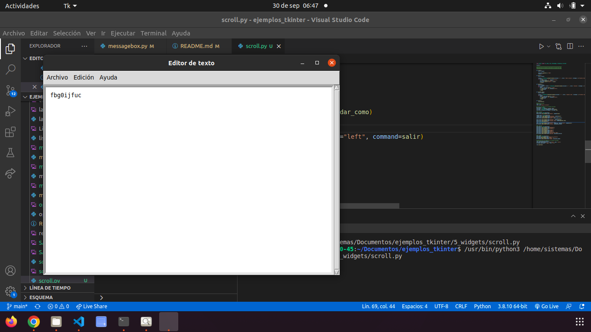
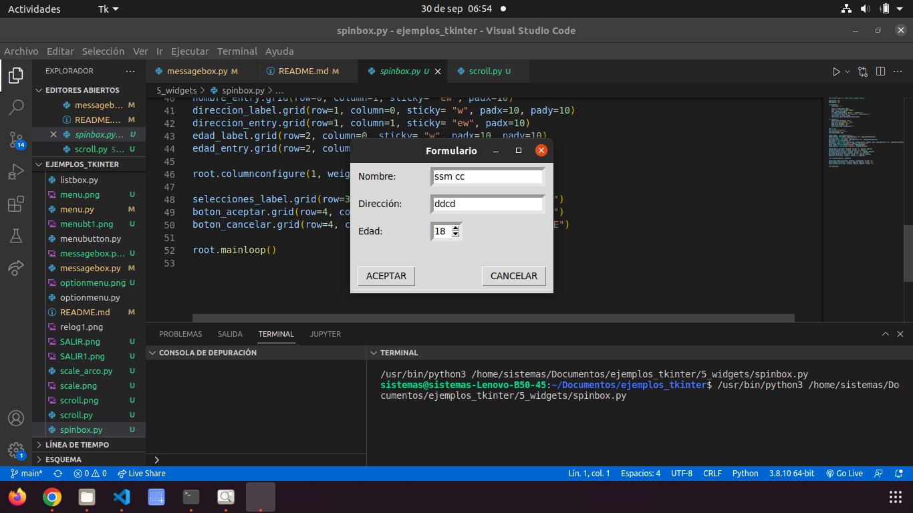
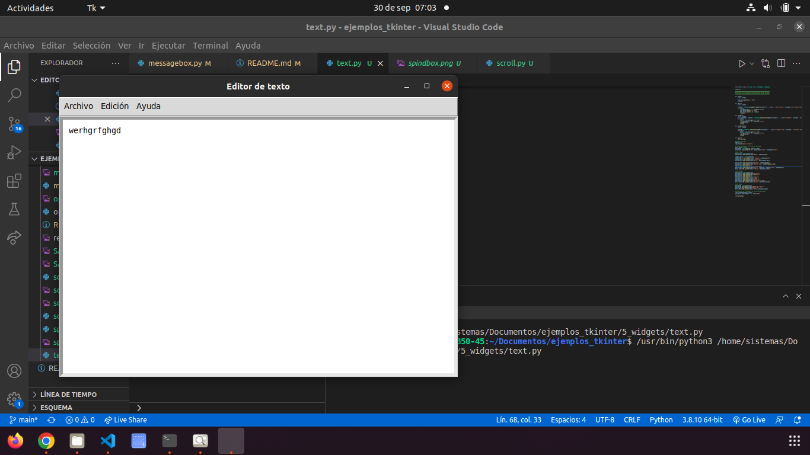
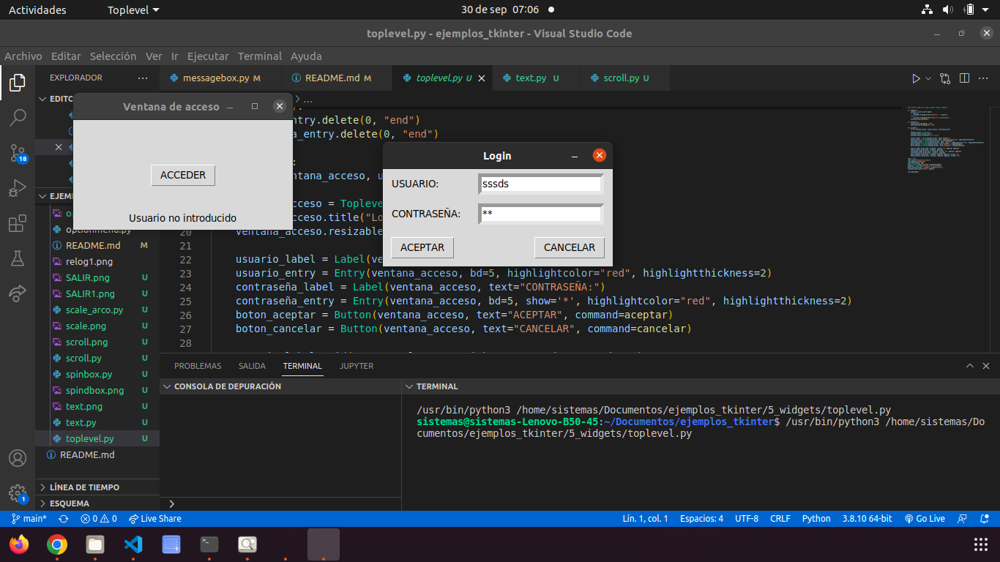

# WIDGTES

## Button

### Este widget nos permite controlar un cronometro, con los botones star y stop, que controlan el cronometro de una manera precisa.

## Entry

### Este widget nos permite escribir en letras, numeros, y se puede usar como una especie de fondo de seguridad.

## Label_reloj 

### Este widget nos permite saber la hora,gracias a el label que proporciona los numeros.

## ListBoX

### Este widget nos ayuda a comodar un gran numero de caracteres y por medio de un boton en este caso podemos saber la traduccion de hola.

## Menu

### Esta opcion nos permite ver y dezplegar un menu, en que hay diversa cantidad de opciones a ejecutar.

## Menu Button 

### Esta funciona con diversos botones y funciones que nos ayudan a crear especies de base de datos.

## Messagebox

### Esta funcion muy parecida a la de menu nos permite mostrar un mensaje a el darle a determinado boton.

## Option Menu

### Este widget nos permite administrar de mejor manera el boton del formulario para asi evitar demoras en el funcionamiento del mismo.

## Scale Arco

### Este widget conformado pór un scroll var nos permite mover el mismo y a medida que el grado se va haciendo mas grande el mismo angulo ira creciendo hasta formar un circulo.

## Scroll

### Este widget nos ayuda a editar el texto si ve que algo esta mal pues automaticamente nos avisara para corregirlo.

# Spind Box

## nos permite  manejar la edad con una serie de flechitas que va aumentando o disminuyendo dependiendo de la opcion que se le de.

# Text

## Nos permite poner determinado texto en la ventana.

# Top Level

## Nos ayuda a por medio de un boton acceder a una ventana de registro de usuario.

