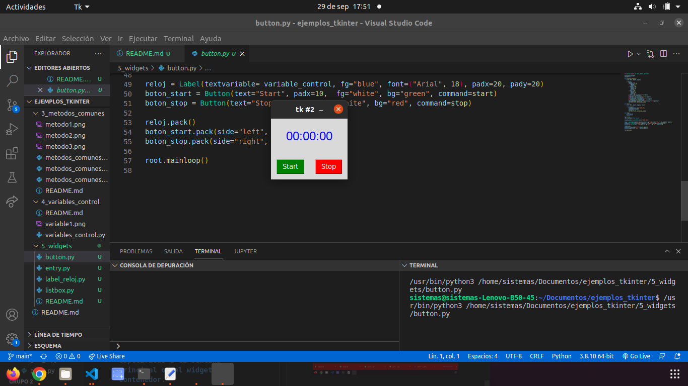
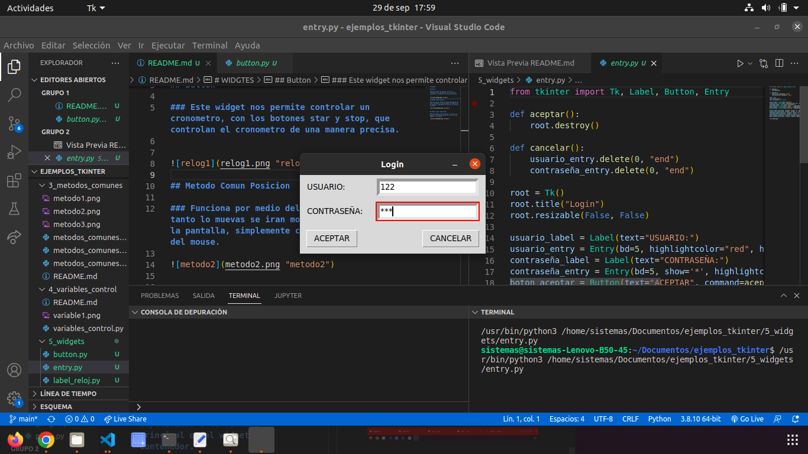
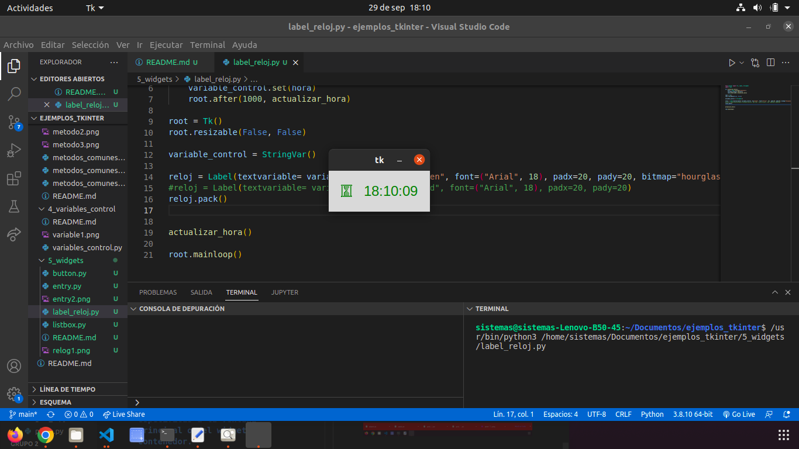
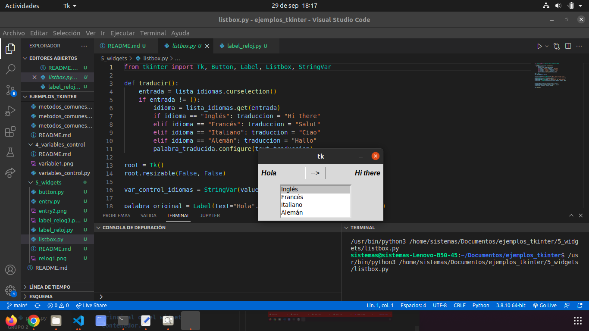

# WIDGTES

## Button

### Este widget nos permite controlar un cronometro, con los botones star y stop, que controlan el cronometro de una manera precisa.

## Entry

### Este widget nos permite escribir en letras, numeros, y se puede usar como una especie de fondo de seguridad.

## Label_reloj 

### Este widget nos permite saber la hora,gracias a el label que proporciona los numeros.

## ListBoX

### Este widget nos ayuda a comodar un gran numero de caracteres y por medio de un boton en este caso podemos saber la traduccion de hola.

## Menu

## Menu Button 

##